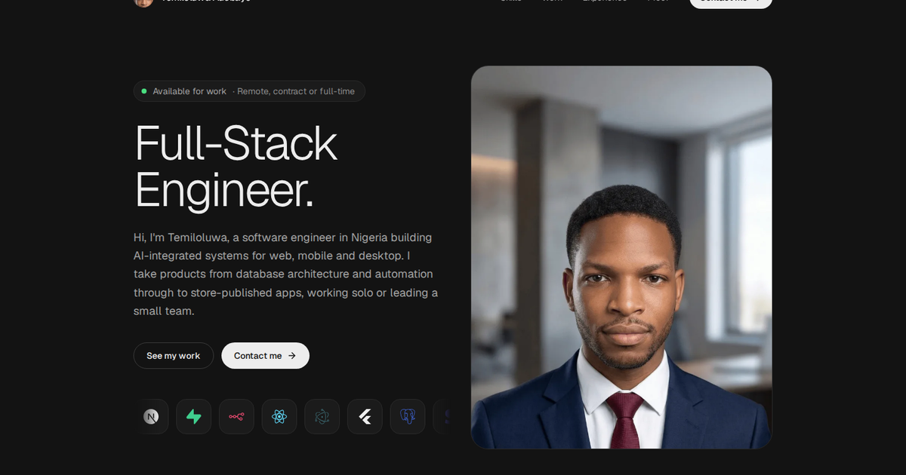

# Temiloluwa Adebayo — Portfolio

Personal portfolio of Temiloluwa Adebayo, full-stack software engineer building AI-integrated systems for web, mobile and desktop.

**Live site:** [my-portfolio-bice-delta-10.vercel.app](https://my-portfolio-bice-delta-10.vercel.app/)



## Sections

| Section | What it shows |
|---|---|
| Hero | Availability, role, intro, portrait, and a drifting row of core tools |
| Tools I build with | The full stack as a pill cloud with brand icons |
| Projects I’ve shipped | Eight projects: real screenshots for live sites, the system's pipeline for the rest |
| Where I’ve worked | Accordion of roles from the CV, plus a CV download |
| Don’t just take my word for it | Two marquees of production figures, each traceable to the CV |
| Contact | Email, CV download, and click-to-copy email address |

## Tech stack

| Layer | Technology |
|---|---|
| Framework | React 19 + TypeScript (strict) |
| Build | Vite 6 |
| Styling | Tailwind CSS v4 (tokens in `src/index.css`) |
| Motion | `motion` (Framer Motion), respects reduced-motion |
| Type | Geist and Geist Mono, self-hosted via Fontsource |
| Icons | `lucide-react`, `simple-icons` for brand marks |
| Hosting | Vercel, with Vercel Web Analytics |

## Project structure

```
├── index.html            # Entry HTML, meta and Open Graph tags
├── public/
│   ├── Temiloluwa_Adebayo_CV.pdf
│   ├── profile.webp      # Portrait (hero)
│   ├── avatar.webp       # Nav and footer avatar
│   ├── og.png            # Social preview image
│   └── work/             # Screenshots of live projects
└── src/
    ├── data.ts           # All content: profile, stack, projects, roles, facts
    ├── App.tsx           # Page sections and components
    ├── index.css         # Design tokens and global styles
    └── main.tsx          # React root, fonts, analytics
```

## Getting started

Requires Node.js 18 or newer.

```bash
npm install
npm run dev       # http://localhost:5173
npm run lint      # type-check
npm run build     # production build in dist/
npm run preview   # serve the build locally
```

## Editing content

Everything on the page lives in `src/data.ts`:

- `PROFILE`: name, role, intro, email, links, CV path, availability.
- `STACK` and `HERO_TOOLS`: tools with their `simple-icons` mark.
- `PROJECTS`: each project has `facts`, `tags`, optional `githubUrl` / `liveUrl`, and either an `image` (a real screenshot in `public/work/`) or a `flow` (the pipeline steps drawn on the card).
- `EXPERIENCE`: roles, dates and bullet points.
- `FACTS`: the production figures in the proof marquee. Keep every one traceable to the CV.

To update the CV, replace `public/Temiloluwa_Adebayo_CV.pdf`.

## Deployment

The repository is connected to Vercel; every push to `main` redeploys automatically. Vercel detects Vite with no extra configuration.

## Author

**Temiloluwa Adebayo** · [GitHub](https://github.com/temiloluwa-adebayo) · [LinkedIn](https://www.linkedin.com/in/temiloluwa-adebayo-4843ba377) · [temidaniel124@gmail.com](mailto:temidaniel124@gmail.com)
